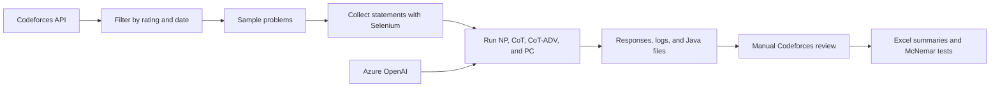
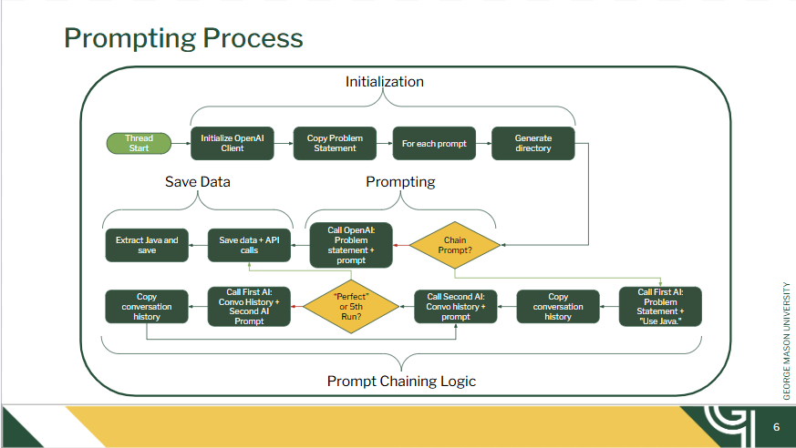

# Prompt Engineering for Competitive Programming

An experimental pipeline and dataset for comparing four prompting strategies on Codeforces problems. The project selects problems by rating and date, collects their statements, asks an Azure OpenAI model to produce Java solutions, preserves the model interactions, and supports manual verdict logging and statistical analysis.

[](https://www.python.org/)
[](https://openjdk.org/)
[](ai-gen-solutions/README.md)
[](LICENSE)
[](LICENSE-DATA.md)

**90 unique problems | 4 prompting strategies | ratings 1600-2400 | raw responses, interaction logs, Java outputs, and verdict analysis**

> [!NOTE]
> This is research code and a published experiment artifact, not a polished Codeforces submission client. The workflow is interactive, depends on the current Codeforces page layout, and requires some local configuration.

## Contents

- [How it works](#how-it-works)
- [Prompting strategies](#prompting-strategies)
- [Repository contents](#repository-contents)
- [Quick start](#quick-start)
- [Run a new experiment](#run-a-new-experiment)
- [Output layout](#output-layout)
- [Record and analyze verdicts](#record-and-analyze-verdicts)
- [Reproducibility notes](#reproducibility-notes)

## How it works





The repository serves two audiences: researchers can inspect the checked-in experiment artifact immediately, while maintainers with Azure OpenAI access can collect a new sample and repeat the pipeline.

## Prompting strategies

The experiment configuration in [`prompts.json`](prompts.json) defines:

| ID | Strategy |
| --- | --- |
| `NP` | Minimal, direct instruction to solve in Java |
| `CoT` | A step-by-step reasoning instruction |
| `CoT-ADV` | A longer structured instruction covering interpretation, algorithm selection, implementation, walkthrough, and complexity |
| `PC` | A prompt-chaining workflow in which a second model critiques the proposed answer and requests revisions, for at most five rounds |

The checked-in results contain 90 unique Codeforces problem IDs. Each appears in its numeric rating bucket and is duplicated under `unrated`, producing 180 problem-directory instances in total. See the [dataset README](ai-gen-solutions/README.md) for the artifact layout.

## Repository contents

| Path | Purpose |
| --- | --- |
| [`generator.py`](generator.py) | Main interactive pipeline: query Codeforces, sample and scrape problems, run prompts concurrently, and save responses |
| [`cf_prompting/`](cf_prompting/) | Shared configuration, artifact, Codeforces, review, rating, and analysis helpers |
| [`prompts.json`](prompts.json) | Names and text of the four prompt treatments |
| [`ai-gen-solutions/`](ai-gen-solutions/) | Published problem statements, model responses, interaction logs, and extracted Java code |
| [`CodeForces_Submitter.py`](CodeForces_Submitter.py) | Clipboard-assisted manual review and verdict logger |
| [`RatingAdder.py`](RatingAdder.py) | One-off utility for adding rating fields to a verdict log |
| [`txt_to_excel.py`](txt_to_excel.py) | Converts verdict logs to an Excel workbook with accuracy summaries and McNemar comparisons |
| [`Data_With_Ratings.txt`](Data_With_Ratings.txt) | Comma-separated experimental verdict data |
| [`data.xlsx`](data.xlsx) | Generated analysis workbook |
| [`tests/`](tests/) | Behavioral regression tests for the pipeline and data tools |
| [`requirements.txt`](requirements.txt) | Runtime dependency ranges for the complete workflow |
| [`requirements-dev.txt`](requirements-dev.txt) | Test, lint, and type-check tools |

## Quick start

Inspect the published results without installing anything:

```text
ai-gen-solutions/<rating>/<problem-id>/<prompt>/
```

Open the same problem under its `NP`, `CoT`, `CoT-ADV`, and `PC` directories to compare treatments. Start with the [dataset guide](ai-gen-solutions/README.md), then use [`Data_With_Ratings.txt`](Data_With_Ratings.txt) or [`data.xlsx`](data.xlsx) for recorded verdicts and aggregate results.

To run the experiment pipeline instead:

```bash
python -m venv .venv
# Windows: .venv\Scripts\activate
# macOS/Linux: source .venv/bin/activate
python -m pip install -r requirements.txt
python generator.py
```

The second command opens an interactive questionnaire. Before running it, complete the Azure and ChromeDriver setup below.

## Requirements

- Python 3.9 or newer
- Google Chrome and a compatible ChromeDriver for collecting new problem statements
- An Azure OpenAI deployment (the code defaults to deployment name `o4-mini` and API version `2025-01-01-preview`)
- Java only if you want to compile or test the generated submissions locally

Install the Python packages used by the complete workflow if you have not used the quick-start command:

```bash
python -m pip install -r requirements.txt
```

The pipeline uses the public Codeforces API for metadata and Selenium plus the system clipboard for statement extraction. Chrome runs with a visible window.

## Run a new experiment

1. Clone the repository and enter it.
2. Create a local credential file such as `api_config.txt` with exactly two lines:

   ```text
   https://YOUR-RESOURCE.openai.azure.com/
   YOUR_AZURE_OPENAI_API_KEY
   ```

3. Keep that file out of version control. If `keys.txt` in your copy contains a real credential, rotate it and remove it from Git history before publishing or sharing the repository.
4. Start the interactive pipeline:

   ```bash
   python generator.py
   ```

5. Answer the prompts for normal or redo mode, rating and contest-date bounds, sample size per rating, ChromeDriver path, prompt file (`prompts.json`), worker count, and credential-file path.

In normal mode the program creates these working paths:

```text
_scraped_problem_statements/   temporary scraped statements
_organized_problems_by_rating/ statements organized by rating and problem
_ai-gen-solutions/             newly generated experiment outputs
solution_status.json           resumable processing state
```

Transient API failures use capped exponential backoff and stop after eight attempts. Authentication and non-transient client failures stop the affected prompt immediately with an actionable error instead of hanging indefinitely. Start with a conservative worker count.

## Output layout

Each generated treatment is stored under:

```text
_ai-gen-solutions/<rating>/<problem-id>/<prompt>/
├── <problem-id>.txt
├── <prompt>-<problem-id>.java
├── <prompt>-response.txt
├── <prompt>-interaction.json
└── api_calls/                  individual call logs, when present
```

Prompt chaining can additionally produce full conversation histories and per-round primary/secondary logs.

## Record and analyze verdicts

`CodeForces_Submitter.py` copies generated Java files to the clipboard in batches and asks you to enter verdicts such as `A` or `WA`:

```bash
python CodeForces_Submitter.py
```

It writes CSV rows in the form `problem_id,prompt_type,verdict`. This helper does **not** submit through the Codeforces API; submission remains a manual browser action. It recognizes both the current `<prompt>-<problem>.java` name and historical underscore-named artifacts such as `PC_1978D.java`.

Add ratings to a three-column verdict log by passing the generated-results directory and input file explicitly:

```bash
python RatingAdder.py ai-gen-solutions review_results.txt --output Final_IDs.txt --missing-log missing_ids.txt
```

Once a log contains ratings as a fourth field, generate the workbook with:

```bash
python txt_to_excel.py
```

You can also pass explicit input and output paths:

```bash
python txt_to_excel.py Final_IDs.txt analysis.xlsx
```

The script reads `Data_With_Ratings.txt` and writes `data.xlsx` with raw data, per-prompt accuracy, solved-treatment combinations, and pairwise McNemar tests comparing `NP` with `CoT`, `CoT-ADV`, and `PC`. Treat the statistical output as exploratory: review the data-cleaning rules and test assumptions before drawing research conclusions.

## Development and verification

Install the development tools into the active virtual environment, then run the complete local check set:

```bash
python -m pip install -r requirements-dev.txt
python -m compileall -q cf_prompting generator.py CodeForces_Submitter.py RatingAdder.py txt_to_excel.py tests
python -m ruff check .
python -m ruff format --check .
python -m mypy cf_prompting generator.py CodeForces_Submitter.py RatingAdder.py txt_to_excel.py
python -m pytest
python -m pip check
python -m pip_audit -r requirements-dev.txt
```

There is no separate production build step for these Python command-line tools. Successful bytecode compilation, static checks, tests, and an end-to-end workbook-generation smoke test serve as build verification. Local credentials, virtual environments, resume state, and newly generated experiment directories are excluded by `.gitignore`; the published `ai-gen-solutions/` dataset remains tracked.

## Reproducibility notes

- Problem sampling uses `random.shuffle` without a fixed seed, so a fresh run is not deterministic.
- Model outputs can vary across deployments, model versions, and dates.
- Codeforces metadata and HTML may change; the scraper selects the `problem-statement` element and copies its rendered text.
- Generated code and model reasoning are experimental artifacts, not verified reference solutions.
- Some checked-in text shows character-encoding artifacts from the original run.

## License

This research project uses two standard licenses:

- **Software:** the original source code is available under the [MIT License](LICENSE).
- **Research materials:** the repository owner's original data, experimental metadata, analysis outputs, and documentation are available under [Creative Commons Attribution 4.0 International](LICENSE-DATA.md). Reusers must provide attribution, link to the license, and identify changes.

Neither license grants rights to third-party material, including Codeforces problem statements, trademarks, or material owned by others. Generated content is covered only to the extent that the repository owner holds rights in it.
